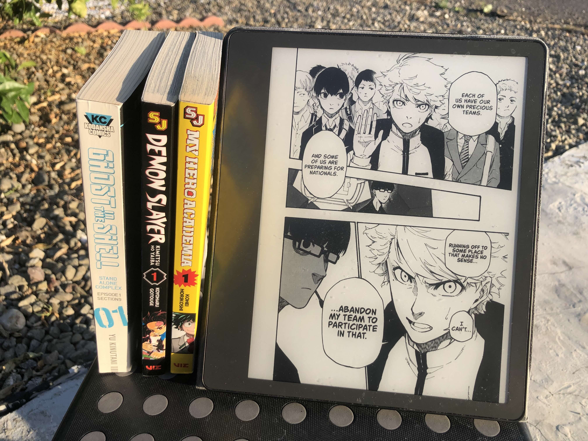

# KCC

[](https://github.com/ciromattia/kcc/releases)
[](https://github.com/ciromattia/kcc/pkgs/container/kcc)
[](https://github.com/ciromattia/kcc/releases)


**Kindle Comic Converter** optimizes black & white comics and manga for E-ink ereaders 
like Kindle, Kobo, ReMarkable, and more.
Pages display in fullscreen without margins, 
with proper fixed layout support.
Supported input formats include JPG/PNG/GIF image files in folders, archives, or PDFs.
Supported output formats include MOBI/AZW3, EPUB, KEPUB, CBZ, and PDF.

**NEW**: PDF output is now supported for direct conversion to reMarkable devices! 
When using a reMarkable profile (Rmk1, Rmk2, RmkPP), the format automatically defaults to PDF 
for optimal compatibility with your device's native PDF reader.

The absolute highest quality source files are print quality DRM-free PDFs from Kodansha/[Humble Bundle](https://humblebundleinc.sjv.io/xL6Zv1)/Fanatical,
which can be directly converted by KCC.

Its main feature is various optional image processing steps to look good on eink screens, 
which have different requirements than normal LCD screens.
Combining that with downscaling to your specific device's screen resolution
can result in filesize reductions of hundreds of MB per volume with no visible quality loss on eink.
This can also improve battery life, page turn speed, and general performance 
on underpowered ereaders with small storage capacities.

KCC avoids many common formatting issues (some of which occur [even on the Kindle Store](https://github.com/ciromattia/kcc/wiki/Kindle-Store-bad-formatting)), such as:
1) faded black levels causing unneccessarily low contrast, which is hard to see and can cause eyestrain.
2) unneccessary margins at the bottom of the screen
3) Not utilizing the full 1860x2480 resolution of the 10" Kindle Scribe
4) incorrect page turn direction for manga that's read right to left
5) unaligned two page spreads in landscape, where pages are shifted over by 1

The GUI looks like this, built in Qt6, with my most commonly used settings:


Simply drag and drop your files/folders into the KCC window, 
adjust your settings (hover over each option to see details in a tooltip), 
and hit convert to create ereader optimized files.
You can change the default output directory by holding `Shift` while clicking the convert button.
Then just drag and drop the generated output files onto your device's documents folder via USB.
If you are on macOS and use a 2022+ Kindle, you may need to use Amazon USB File Manager for Mac.

YouTube tutorial (please subscribe): https://www.youtube.com/watch?v=IR2Fhcm9658

### A word of warning
**KCC** _is not_ [Amazon's Kindle Comic Creator](http://www.amazon.com/gp/feature.html?ie=UTF8&docId=1001103761) nor is in any way endorsed by Amazon.
Amazon's tool is for comic publishers and involves a lot of manual effort, while **KCC** is for comic/manga readers.
_KC2_ in no way is a replacement for **KCC** so you can be quite confident we are going to carry on developing our little monster ;-)

### Issues / new features / donations
If you have general questions about usage, feedback etc. please [post it here](http://www.mobileread.com/forums/showthread.php?t=207461).
If you have some **technical** problems using KCC please [file an issue here](https://github.com/ciromattia/kcc/issues/new).
If you can fix an open issue, fork & make a pull request.

If you find **KCC** valuable you can consider donating to the authors:
- Ciro Mattia Gonano (founder, active 2012-2014):

  [](https://www.paypal.com/cgi-bin/webscr?cmd=_s-xclick&hosted_button_id=D8WNYNPBGDAS2)

- Paweł Jastrzębski (active 2013-2019):

  [](https://www.paypal.com/cgi-bin/webscr?cmd=_s-xclick&hosted_button_id=YTTJ4LK2JDHPS)
  [](https://jastrzeb.ski/donate/)

- Alex Xu (active 2023-Present)

  [](https://ko-fi.com/Q5Q41BW8HS)

## Commissions

This section is subject to change:

Email (for commisions and inquiries): `kindle.comic.converter` gmail


## Sponsors

- Free code signing on Windows provided by [SignPath.io](https://about.signpath.io/), certificate by [SignPath Foundation](https://signpath.org/)

## DOWNLOADS

- **https://github.com/ciromattia/kcc/releases**

Click on **Assets** of the latest release.

You probably want either
- `KCC_*.*.*.exe` (Windows)
- `kcc_macos_arm_*.*.*.dmg` (recent Mac with Apple Silicon M1 chip or later)
- `kcc_macos_i386_*.*.*.dmg` (older Mac with Intel chip macOS 12+)

There are also legacy macOS 10.14+ and Windows 7 experimental versions available.

The `c2e` and `c2p` versions are command line tools for power users.

On Mac, right click open to get past the security warning.

For flatpak, Docker, and AppImage versions, refer to the wiki: https://github.com/ciromattia/kcc/wiki/Installation

## FAQ
- Should I use Calibre?
  - No. Calibre doesn't properly support fixed layout EPUB/MOBI, so modifying KCC output in Calibre will break the formatting.
    Viewing KCC output in Calibre will also not work properly.
    On 7th gen and later Kindles running firmware 5.15.1+, you can get cover thumbnails simply by USB dropping into documents folder.
    On 6th gen and older, you can get cover thumbnails by keeping Kindle plugged in during conversion.
    If you are careful to not modify the file however, you can still use Calibre, but direct USB dropping is reccomended.
- What output format should I use?
  - MOBI for Kindles. CBZ for Kindle DX. CBZ for Koreader. KEPUB for Kobo.
- All options have additional information in tooltips if you hover over the option.
- To get the converted book onto your Kindle/Kobo, just drag and drop the mobi/kepub into the documents folder on your Kindle/Kobo via USB
- Right to left mode not working?
  - RTL mode only affects splitting order for CBZ output. Your cbz reader itself sets the page turn direction.
- Colors inverted?
  - Disable Kindle dark mode
- Cannot connect Kindle Scribe or 2024+ Kindle to macOS
  - Use official MTP [Amazon USB File Transfer app](https://www.amazon.com/gp/help/customer/display.html/ref=hp_Connect_USB_MTP?nodeId=TCUBEdEkbIhK07ysFu)
    (no login required). Works much better than previously recommended Android File Transfer. Cannot run simutaneously with other transfer apps.
- How to make AZW3 instead of MOBI?
  - The `.mobi` file generated by KCC is a dual filetype, it's both MOBI and AZW3. The file extension is `.mobi` for compatibility reasons.
- [Windows 7 support](https://github.com/ciromattia/kcc/issues/678)
- Image too dark?
  - The default gamma correction of 1.8 makes the image darker, and is useful for faded/gray artwork/text. Disable by setting gamma = 1.0
- Huge margins / slow page turns?
  - You likely modified the file during transfer using a 3rd party app. Try simply dragging and dropping the final mobi/kepub file into the Kindle documents folder via USB.

## PREREQUISITES

You'll need to install various tools to access important but optional features. Close and re-open KCC to get KCC to detect them.

### KindleGen

On Windows and macOS, install [Kindle Previewer](https://www.amazon.com/Kindle-Previewer/b?ie=UTF8&node=21381691011) and `kindlegen` will be autodetected from it.

If you have issues detecting it, get stuck on the MOBI conversion step, or use Linux AppImage or Flatpak, refer to the wiki: https://github.com/ciromattia/kcc/wiki/Installation#kindlegen

### 7-Zip

This is optional but will make conversions much faster.

This is required for certain files and advanced features. 

KCC will ask you to install if needed.

Refer to the wiki to install: https://github.com/ciromattia/kcc/wiki/Installation#7-zip

## INPUT FORMATS
**KCC** can understand and convert, at the moment, the following input types:
- Folders containing: PNG, JPG, GIF or WebP files
- CBZ, ZIP *(With `7z` executable)*
- CBR, RAR *(With `7z` executable)*
- CB7, 7Z *(With `7z` executable)*
- PDF *(Only extracting JPG images)*

## USAGE

Should be pretty self-explanatory. All options have detailed information in tooltips.
After completed conversion, you should find ready file alongside the original input file (same directory).

Please check [our wiki](https://github.com/ciromattia/kcc/wiki/) for more details.

CLI version of **KCC** is intended for power users. It allows using options that might not be compatible and decrease the quality of output.
CLI version has reduced dependencies, on Debian based distributions this commands should install all needed dependencies:
```
sudo apt-get install python3 p7zip-full python3-pil python3-psutil python3-slugify
```

### Profiles:

```
        'K1': ("Kindle 1", (600, 670), Palette4, 1.8),
        'K11': ("Kindle 11", (1072, 1448), Palette16, 1.8),
        'K2': ("Kindle 2", (600, 670), Palette15, 1.8),
        'K34': ("Kindle Keyboard/Touch", (600, 800), Palette16, 1.8),
        'K57': ("Kindle 5/7", (600, 800), Palette16, 1.8),
        'K810': ("Kindle 8/10", (600, 800), Palette16, 1.8),
        'KDX': ("Kindle DX/DXG", (824, 1000), Palette16, 1.8),
        'KPW': ("Kindle Paperwhite 1/2", (758, 1024), Palette16, 1.8),
        'KV': ("Kindle Voyage, (1072, 1448), Palette16, 1.8),
        'KPW34': ("Kindle Paperwhite 3/4/Oasis", (1072, 1448), Palette16, 1.8),
        'KPW5': ("Kindle Paperwhite 5/Signature Edition", (1236, 1648), Palette16, 1.8),
        'KO': ("Kindle Oasis 2/3/Paperwhite 12/Colorsoft 12", (1264, 1680), Palette16, 1.8),
        'KS': ("Kindle Scribe", (1860, 2480), Palette16, 1.8),
        'KoMT': ("Kobo Mini/Touch", (600, 800), Palette16, 1.8),
        'KoG': ("Kobo Glo", (768, 1024), Palette16, 1.8),
        'KoGHD': ("Kobo Glo HD", (1072, 1448), Palette16, 1.8),
        'KoA': ("Kobo Aura", (758, 1024), Palette16, 1.8),
        'KoAHD': ("Kobo Aura HD", (1080, 1440), Palette16, 1.8),
        'KoAH2O': ("Kobo Aura H2O", (1080, 1430), Palette16, 1.8),
        'KoAO': ("Kobo Aura ONE", (1404, 1872), Palette16, 1.8),
        'KoN': ("Kobo Nia", (758, 1024), Palette16, 1.8),
        'KoC': ("Kobo Clara HD/Kobo Clara 2E", (1072, 1448), Palette16, 1.8),
        'KoCC': ("Kobo Clara Colour", (1072, 1448), Palette16, 1.8),
        'KoL': ("Kobo Libra H2O/Kobo Libra 2", (1264, 1680), Palette16, 1.8),
        'KoLC': ("Kobo Libra Colour", (1264, 1680), Palette16, 1.8),
        'KoF': ("Kobo Forma", (1440, 1920), Palette16, 1.8),
        'KoS': ("Kobo Sage", (1440, 1920), Palette16, 1.8),
        'KoE': ("Kobo Elipsa", (1404, 1872), Palette16, 1.8),
        'Rmk1': ("reMarkable 1", (1404, 1872), Palette16, 1.8),
        'Rmk2': ("reMarkable 2", (1404, 1872), Palette16, 1.8),
        'RmkPP': ("reMarkable Paper Pro", (1620, 2160), Palette16, 1.8),
        'OTHER': ("Other", (0, 0), Palette16, 1.8),
```

### Standalone `kcc-c2e.py` usage:

```
usage: kcc-c2e [options] [input]

MANDATORY:
  input                 Full path to comic folder or file(s) to be processed.

MAIN:
  -p PROFILE, --profile PROFILE
                        Device profile (Available options: K1, K2, K34, K578, KDX, KPW, KPW5, KV, KO, K11, KS, KoMT, KoG, KoGHD, KoA, KoAHD, KoAH2O, KoAO, KoN, KoC, KoCC, KoL, KoLC, KoF, KoS, KoE)
                        [Default=KV]
  -m, --manga-style     Manga style (right-to-left reading and splitting)
  -q, --hq              Try to increase the quality of magnification
  -2, --two-panel       Display two not four panels in Panel View mode
  -w, --webtoon         Webtoon processing mode
  --ts TARGETSIZE, --targetsize TARGETSIZE
                        the maximal size of output file in MB. [Default=100MB for webtoon and 400MB for others]

PROCESSING:
  -n, --noprocessing    Do not modify image and ignore any profil or processing option
  -u, --upscale         Resize images smaller than device's resolution
  -s, --stretch         Stretch images to device's resolution
  -r SPLITTER, --splitter SPLITTER
                        Double page parsing mode. 0: Split 1: Rotate 2: Both [Default=0]
  -g GAMMA, --gamma GAMMA
                        Apply gamma correction to linearize the image [Default=Auto]
  --autolevel           Set most common dark pixel value to be black point for leveling.
  -c CROPPING, --cropping CROPPING
                        Set cropping mode. 0: Disabled 1: Margins 2: Margins + page numbers [Default=2]
  --cp CROPPINGP, --croppingpower CROPPINGP
                        Set cropping power [Default=1.0]
  --preservemargin      After calculating crop, "back up" a specified percentage amount [Default=0]
  --cm CROPPINGM, --croppingminimum CROPPINGM
                        Set cropping minimum area ratio [Default=0.0]
  --ipc INTERPANELCROP, --interpanelcrop INTERPANELCROP
                        Crop empty sections. 0: Disabled 1: Horizontally 2: Both [Default=0]
  --blackborders        Disable autodetection and force black borders
  --whiteborders        Disable autodetection and force white borders
  --forcecolor          Don't convert images to grayscale
  --forcepng            Create PNG files instead JPEG
  --mozjpeg             Create JPEG files using mozJpeg
  --maximizestrips      Turn 1x4 strips to 2x2 strips
  -d, --delete          Delete source file(s) or a directory. It's not recoverable.

OUTPUT SETTINGS:
  -o OUTPUT, --output OUTPUT
                        Output generated file to specified directory or file
  -t TITLE, --title TITLE
                        Comic title [Default=filename or directory name]
  --metadatatitle      Write title from ComicInfo.xml or other embedded metadata
  -a AUTHOR, --author AUTHOR
                        Author name [Default=KCC]
  -f FORMAT, --format FORMAT
                        Output format (Available options: Auto, MOBI, EPUB, CBZ, PDF, KFX, MOBI+EPUB) [Default=Auto]
  --nokepub             If format is EPUB, output file with '.epub' extension rather than '.kepub.epub'
  -b BATCHSPLIT, --batchsplit BATCHSPLIT
                        Split output into multiple files. 0: Don't split 1: Automatic mode 2: Consider every subdirectory as separate volume [Default=0]
  --spreadshift         Shift first page to opposite side in landscape for two page spread alignment
  --norotate            Do not rotate double page spreads in spread splitter option.
  --rotatefirst         Put rotated spread first in spread splitter option.
  --eraserainbow       Erase rainbow effect on color eink screen by attenuating interfering frequencies

CUSTOM PROFILE:
  --customwidth CUSTOMWIDTH
                        Replace screen width provided by device profile
  --customheight CUSTOMHEIGHT
                        Replace screen height provided by device profile

OTHER:
  -h, --help            Show this help message and exit

```

### Standalone `kcc-c2p.py` usage:

```
usage: kcc-c2p [options] [input]

MANDATORY:
  input                 Full path to comic folder(s) to be processed. Separate multiple inputs with spaces.

MAIN:
  -y HEIGHT, --height HEIGHT
                        Height of the target device screen
  -i, --in-place        Overwrite source directory
  -m, --merge           Combine every directory into a single image before splitting

OTHER:
  -d, --debug           Create debug file for every split image
  -h, --help            Show this help message and exit
```

## INSTALL FROM SOURCE

This section is for developers who want to contribute to KCC or power users who want to run the latest code without waiting for an official release.

Easiest to use [GitHub Desktop](https://desktop.github.com) to clone your fork of the KCC repo. From GitHub Desktop, click on `Repository` in the toolbar, then `Command Prompt` (Windows)/`Terminal` (Mac) to open a window in the KCC repo.

Depending on your system [Python](https://www.python.org) may be called either `python` or `python3`. We use virtual environments (venv) to manage dependencies.

If you want to edit the code, a good code editor is [VS Code](https://code.visualstudio.com).

If you want to edit the `.ui` files, use `pyside6-designer` which is included in the `pip install pyside6`.
Then use the `gen_ui_files` scripts to autogenerate the python UI.

An example PR adding a new checkbox is here: https://github.com/ciromattia/kcc/pull/785

video of adding a new checkbox: https://youtu.be/g3I8DU74C7g

Do not use `git merge` to merge master from upstream, 
use the "Sync fork" button on your fork on GitHub in your branch 
to avoid weird looking merges in pull requests.

When making changes, be aware of how your change might affect file splitting/chunking
or chapter alignment.

### Windows install from source

One time setup and running for the first time:
```
python -m venv venv
venv\Scripts\activate.bat
pip install -r requirements.txt
python kcc.py
```

Every time you close Command Prompt, you will need to re-activate the virtual environment and re-run:

```
venv\Scripts\activate.bat
python kcc.py
```

You can build a `.exe` of KCC like the downloads we offer with

```
python setup.py build_binary
```

### macOS install from source

If the system installed Python gives you issues, please install the latest Python from either brew or the official website.

One time setup and running for the first time:
```
python3 -m venv venv
source venv/bin/activate
pip install -r requirements.txt
python kcc.py
```

Every time you close Terminal, you will need to reactivate the virtual environment and re-run:

```
source venv/bin/activate
python kcc.py
```

You can build a `.app` of KCC like the downloads we offer with

```
python setup.py build_binary
```

## CREDITS
**KCC** is made by

- [Ciro Mattia Gonano](http://github.com/ciromattia)
- [Paweł Jastrzębski](http://github.com/AcidWeb)
- [Darodi](http://github.com/darodi)
- [Alex Xu](http://github.com/axu2)

This script born as a cross-platform alternative to `KindleComicParser` by **Dc5e** (published [here](http://www.mobileread.com/forums/showthread.php?t=192783)).

The app relies and includes the following scripts:

 - `DualMetaFix` script by **K. Hendricks**. Released with GPL-3 License.
 - `image.py` class from **Alex Yatskov**'s [Mangle](https://github.com/FooSoft/mangle/) with subsequent [proDOOMman](https://github.com/proDOOMman/Mangle)'s and [Birua](https://github.com/Birua/Mangle)'s patches.
 - Icon is by **Nikolay Verin** ([http://ncrow.deviantart.com/](http://ncrow.deviantart.com/)) and released under [CC BY-NC-SA 3.0](http://creativecommons.org/licenses/by-nc-sa/3.0/) License.

## SAMPLE FILES CREATED BY KCC

https://www.mediafire.com/folder/ixh40veo6hrc5/kcc_samples

Older links (dead):


* [Kindle Oasis 2 / 3](http://kcc.iosphe.re/Samples/Ubunchu!-KO.mobi)
* [Kindle Paperwhite 3 / 4 / Voyage / Oasis](http://kcc.iosphe.re/Samples/Ubunchu!-KV.mobi)
* [Kindle Paperwhite 1 / 2](http://kcc.iosphe.re/Samples/Ubunchu!-KPW.mobi)
* [Kindle](http://kcc.iosphe.re/Samples/Ubunchu!-K578.mobi)
* [Kobo Aura](http://kcc.iosphe.re/Samples/Ubunchu-KoA.kepub.epub)
* [Kobo Aura HD](http://kcc.iosphe.re/Samples/Ubunchu-KoAHD.kepub.epub)
* [Kobo Aura H2O](http://kcc.iosphe.re/Samples/Ubunchu-KoAH2O.kepub.epub)
* [Kobo Aura ONE](http://kcc.iosphe.re/Samples/Ubunchu-KoAO.kepub.epub)
* [Kobo Forma](http://kcc.iosphe.re/Samples/Ubunchu-KoF.kepub.epub)

## PRIVACY
**KCC** is initiating internet connections in two cases:
* During startup - Version check and announcement check.
* When error occurs - Automatic reporting on Windows and macOS.

## KNOWN ISSUES
Please check [wiki page](https://github.com/ciromattia/kcc/wiki/Known-issues).

## COPYRIGHT
Copyright (c) 2012-2025 Ciro Mattia Gonano, Paweł Jastrzębski, Darodi and Alex Xu.
**KCC** is released under ISC LICENSE; see [LICENSE.txt](./LICENSE.txt) for further details.

## Verification
Impact-Site-Verification: ffe48fc7-4f0c-40fd-bd2e-59f4d7205180
